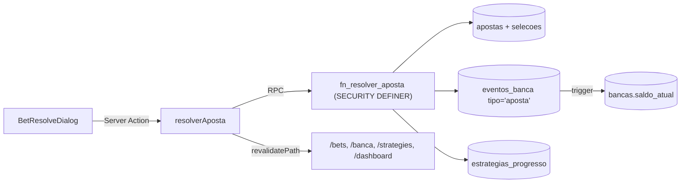

# Smart Bet

Sistema pessoal de **gestão e análise inteligente de apostas esportivas**. Cada aposta é registrada dentro de uma **estratégia nomeada** com regras parametrizadas, permitindo medir objetivamente o que funciona, o que destrói a banca, e — futuramente — automatizar a tomada de decisão com sinais ao vivo.

> Nasceu para resolver a dor real de quem aposta com método e tenta controlar tudo em planilhas: ROI por estratégia, hit rate, drawdown, streaks, EV+ — sem importar CSV no Excel toda noite.

---

## Visão do produto (roadmap por fases)

| Fase | Escopo | Status |
|---|---|---|
| **1 — MVP** | Registro manual de apostas, controle de banca, estratégias com regras (AST) e dashboard analítico | ✅ Em andamento |
| **2** | Coleta semiautomática de jogos da próxima rodada (scraping/feed) | ⏳ Planejado |

### O que já está implementado (Fase 1)

- **Autenticação** — login, registro e logout via Supabase Auth com proteção por middleware e RLS por `auth.uid()`.
- **Admin** — CRUDs de Esportes, Países, Ligas, Times e Tipos de Aposta (somente admin), com soft-delete e filtros.
- **Banca** — múltiplas bancas por usuário, eventos transacionais (depósito, saque, ajuste, **aposta**), saldo recalculado por trigger no banco.
- **Estratégias** — CRUD com wizard de 4 passos (Identidade · Escopo · Gestão · Regras), método de stake configurável (livre, fixo, percentual, progressão, Kelly), regras como AST avaliável (`AND`/`OR`/condições), guardrails (drawdown, reds consecutivos, yield mínimo) e versionamento automático das regras.
- **Apostas** — registro de apostas **simples** e **múltiplas**, validação bloqueante contra as regras da estratégia (com override explícito + motivo), resolução transacional (`ganha`, `perdida`, `meio_green`, `meio_red`, `anulada`, `cashout`) que atualiza simultaneamente `apostas`, `apostas_selecoes`, `eventos_banca` e `estrategias_progresso`.
- **Dashboard** — visão geral com banca consolidada, ROI, hit rate, apostas no mês, atividade recente e atalhos por área.

---

## Stack técnica

| Camada | Tecnologia |
|---|---|
| **Framework** | Next.js 16 (App Router) + React 19 + TypeScript |
| **UI / Estilo** | Tailwind CSS v4 + shadcn/ui (preset `base-nova`, paleta neutral) + `@base-ui/react` |
| **Backend / DB** | Supabase (PostgreSQL + Auth + RLS + Realtime + Storage) |
| **Estado servidor** | React Server Components + Server Actions + `React.cache` para deduplicação |
| **Estado cliente** | TanStack Query (cache de queries reativas) |
| **Formulários** | React Hook Form + Zod (mesmos schemas no client e no server) |
| **Gráficos** | Recharts |
| **Ícones** | lucide-react |
| **Datas / utils** | date-fns, clsx, tailwind-merge |
| **Qualidade** | ESLint + Prettier + Husky + lint-staged |
| **Notificações UI** | Sonner |
| **Deploy alvo** | Vercel (frontend) + Supabase Cloud (backend) |

---

## Arquitetura

### Princípios

1. **Server-first**. Toda página inicia em RSC, busca dados via `React.cache` (deduplica chamadas no mesmo render) e só "hidrata" para Client Component nos pontos interativos (forms, dialogs, filtros).
2. **Mutations via Server Actions** com `revalidatePath` cirúrgico — sem `useSWR` para revalidar listagens.
3. **Validação dupla com Zod** — o mesmo schema valida no form (preview imediato) e no Server Action (defesa em profundidade).
4. **Transações no banco**, não no app. Operações compostas (criar aposta, resolver aposta, reabrir aposta) ficam em `RPC SECURITY DEFINER` que valida `auth.uid()` antes de qualquer write — assim não há janela de inconsistência entre `apostas` ↔ `eventos_banca` ↔ `estrategias_progresso`.
5. **RLS sempre ligada**. Políticas separadas por operação (`select`/`insert`/`update`/`delete`) usando `(select auth.uid()) = usuario_id`.
6. **Domain-first naming em PT-BR** no banco (`apostas`, `bancas`, `estrategias`, `eventos_banca`) — espelha o dia a dia de quem usa.

### Fluxo de uma aposta resolvida



---

## Estrutura de pastas

```
smart-bet/
├── src/
│   ├── app/
│   │   ├── (auth)/                     # rotas públicas (login, registro)
│   │   └── (app)/                      # rotas autenticadas
│   │       ├── dashboard/              # visão geral
│   │       ├── banca/                  # CRUD de bancas + eventos financeiros
│   │       ├── strategies/             # CRUD de estratégias + wizard + regras
│   │       ├── bets/                   # CRUD de apostas + resolução + filtros
│   │       └── admin/                  # catálogos globais (esportes, ligas, times, tipos)
│   ├── components/
│   │   ├── ui/                         # primitivos (shadcn/ui)
│   │   ├── ui-kit/                     # blocos reutilizáveis (StatusBadge, EmptyState)
│   │   ├── dashboard/                  # StatCard, etc.
│   │   ├── layout/                     # PageHeader, NavSidebar, etc.
│   │   └── providers/                  # ThemeProvider, QueryProvider
│   ├── features/                       # feature-folders com camada de dados isolada
│   │   ├── admin/                      # (esportes|paises|ligas|times|tipos-aposta)
│   │   ├── banca/                      # queries.ts, actions.ts, schema.ts
│   │   ├── strategies/                 # idem + rules-catalog.ts (AST)
│   │   ├── bets/                       # idem + rules-evaluator.ts + resolver.ts
│   │   └── dashboard/                  # query agregada
│   ├── lib/
│   │   ├── supabase/                   # clients (browser / server / middleware)
│   │   ├── auth/                       # requireAuth, requireAdmin
│   │   ├── format.ts                   # formatMoney, formatPercent, formatDateTime
│   │   ├── slug.ts
│   │   └── env.ts
│   ├── middleware.ts                   # gestão de sessão Supabase + proteção de rotas
│   └── types/
│       └── supabase.ts                 # tipos gerados via `supabase gen types`
├── supabase/
│   └── migrations/                     # 28 migrations versionadas (schema + RLS + RPCs)
└── public/
```

> **Convenção:** cada feature em `src/features/<dominio>/` exporta `queries.ts` (RSC, com `React.cache`), `actions.ts` (Server Actions), `schema.ts` (Zod) e arquivos auxiliares de domínio. Components vivem em `src/app/(app)/<rota>/_components/`.

---

## Modelagem do banco (alto nível)

| Tabela | Papel |
|---|---|
| `perfis` | Espelho de `auth.users` com role (`admin`/`user`) |
| `esportes`, `paises`, `ligas`, `times`, `tipos_aposta` | Catálogos globais |
| `bancas` | Múltiplas bancas por usuário (saldo inicial/atual, moeda, casa) |
| `eventos_banca` | Trilha de auditoria (deposito/saque/ajuste/aposta) — trigger atualiza `bancas.saldo_atual` |
| `estrategias` | Estratégia com regras (`regras_jsonb` como AST), método de stake, escopo, guardrails |
| `estrategias_tipos_aposta`, `estrategias_ligas` | Junções N:N |
| `estrategias_regras_versoes` | Versionamento automático quando `regras_jsonb` muda |
| `estrategias_progresso` | Snapshot por estratégia (passo atual, streaks, lucro acumulado) |
| `partidas` | Híbrido: aceita FK de times **ou** nomes livres (modo MVP) |
| `apostas`, `apostas_selecoes` | Aposta principal + N seleções (suporta múltipla) |

Enums chave: `status_aposta` (pendente/ganha/perdida/anulada/cashout/meio_green/meio_red), `formato_aposta` (simples/multipla/sistema), `metodo_stake` (livre/fixo/percentual/progressao/kelly), `tipo_evento_banca` (saldo_inicial/deposito/saque/ajuste/**aposta**).

---

## Setup local

### 1. Pré-requisitos

- **Node.js 20+** (testado em 24.x)
- **npm 10+** (testado em 11.x)
- **Conta Supabase** (Cloud) (definido em `package.json` no script `db:types`)

### 2. Instalar dependências

```bash
npm install
```

O `prepare` script instala automaticamente os hooks do Husky.

### 3. Variáveis de ambiente

```bash
cp .env.example .env.local
```

Preencha com as credenciais do seu projeto Supabase:

```
NEXT_PUBLIC_SUPABASE_URL=
NEXT_PUBLIC_SUPABASE_ANON_KEY=
SUPABASE_SERVICE_ROLE_KEY=   # apenas para scripts admin / seeds
```

### 4. Aplicar migrations no Supabase

As 28 migrations em `supabase/migrations/` são aditivas e ordenadas. Use o Supabase CLI ou o MCP equivalente. Em ambiente novo:

```bash
npx supabase link --project-ref <seu-project-ref>
npx supabase db push
```

### 5. Rodar em desenvolvimento

```bash
npm run dev
```

App sobe em http://localhost:3000 com Turbopack.

### 6. Login inicial

O seed cria um usuário admin: **`admin@smartbet.com`**.

> **Segurança:** altere a senha default imediatamente após o primeiro acesso em qualquer ambiente além do local. Veja a migration `0008` para referência.

---

## Scripts disponíveis

| Script | O que faz |
|---|---|
| `npm run dev` | Ambiente de desenvolvimento (Turbopack) |
| `npm run build` | Build de produção |
| `npm start` | Executa o build de produção |
| `npm run lint` | ESLint |
| `npm run lint:fix` | ESLint com correção automática |
| `npm run format` | Prettier em todos os arquivos |
| `npm run format:check` | Verifica formatação sem alterar |
| `npm run type-check` | `tsc --noEmit` |
| `npm run db:types` | Regenera `src/types/supabase.ts` a partir do schema remoto (requer `supabase link` prévio) |

---

## Qualidade de código

- **ESLint** com config do Next.js + regras de hooks.
- **Prettier** + `prettier-plugin-tailwindcss` (ordena classes automaticamente).
- **Husky** + **lint-staged** rodam no `pre-commit`: ESLint `--fix` + Prettier `--write` apenas nos arquivos modificados.
- **Type-check** rigoroso (`strict: true`) e `next build` sem warnings.

---

## Conceitos do produto

### Estratégia

Uma estratégia é um conjunto de **regras avaliáveis** que definem quando vale entrar em uma aposta. Exemplo:

```
"Ambas Marcam (BTTS Sim) — pre-live, futebol":
  btts_historico_ambos >= 60%
  AND media_gols_time_casa >= 1.2
  AND media_gols_time_fora >= 1.1
Stake: percentual de 2% do saldo atual da banca
```

A estratégia também guarda **escopo** (esporte, ligas, tipos de aposta permitidos, faixa de odd, contexto pre-live/ao-vivo, minuto mínimo) e **guardrails** (drawdown alerta, reds consecutivos, yield mínimo, lembrete de revisão).

### Validação bloqueante

Ao registrar uma aposta dentro de uma estratégia, o sistema:

1. Avalia as regras da estratégia contra o contexto da aposta (odd, liga, tipo, etc).
2. Se alguma regra violar → **bloqueia** o submit e mostra um banner com as violações.
3. Permite **override explícito** ("registrar fora do escopo") com motivo obrigatório, marcando a aposta com `estrategia_override = true` para análise futura.

A mesma lógica roda no client (preview imediato) e no server (defesa).

### Resolução transacional

Resolver uma aposta dispara um único RPC `SECURITY DEFINER` que:

1. Atualiza `apostas` (status, lucro, retorno, resolvida_em) e `apostas_selecoes` em cascata.
2. Insere um `eventos_banca` do tipo `aposta` com o lucro/prejuízo — trigger atualiza `bancas.saldo_atual` automaticamente.
3. Recalcula `estrategias_progresso` (passo atual, streaks, totais, lucro acumulado) lendo `metodo_stake`.

A operação é atômica: se algo falhar, nada é gravado.

### Apostas múltiplas

Múltiplas com 2+ seleções têm `odd_total` validado por trigger contra o produto das odds (tolerância 0.01). O status agregado da múltipla é recalculado por trigger sempre que o status de uma seleção muda — qualquer `perdida` derruba a aposta inteira; só vira `ganha` quando todas as seleções são `ganha`/`anulada`.

---

## Licença

Uso privado. Todos os direitos reservados.
